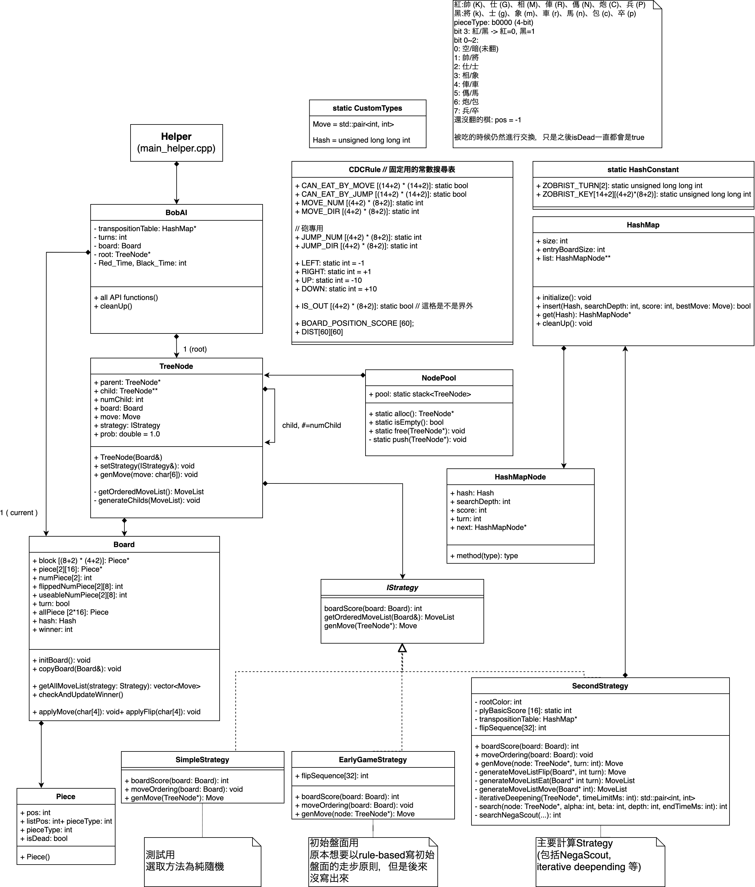
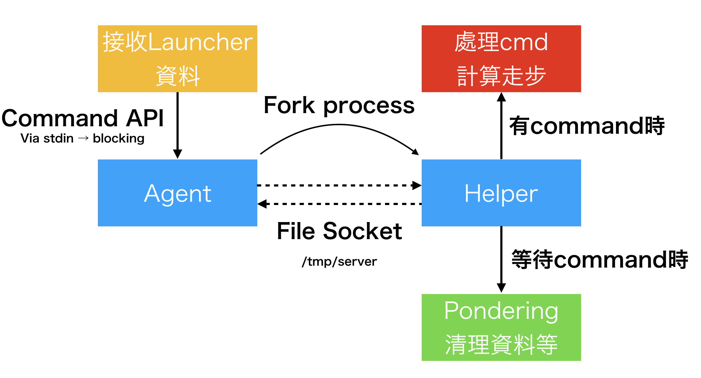

# Final Project: Chinese Dark Chess AI

######  R07922018 資工碩二 王柏翔 | Theory of Computer Games (Fall 2019)

## Project概要

​	此次的Final Project是以NegaScout剪枝搜尋來實作象棋的暗棋AI。同時，還要使用Transposition table(Hash table)來快取已經在negascout裡計算過的路徑，以及自定義走步排序(Move Ordering)來增進NegaScout的效率。

## 編譯方式

```bash
make
./target/agent # 主程式, 接收API的資料
./target/helper # 助手程式, 實際運算暗棋genMove等
```

## 執行方式

- 在暗棋程式`Launcher.jar`的AI欄中填入`agent`的路徑，`agent`會自動開啟`helper`，並且在`/tmp/server`建立一個socket供兩個程式間互相傳送資料。程式執行結束時會將之刪除。

## System Overview

以下是一張軟體的架構圖(Class Diagram)：



其中這裡列的所有的class 都是屬於helper (`main_helper.cpp`)來管理以及計算的。這個程式負責接收前端agent(`main_agent.cpp`)的socket通訊接收資料，這樣可以達到兩個程式一起執行的效果，也不用被stdin的blocking api 限制住，可以同時做其他的事情。



## Implementation

### NegaScout 演算法 & Iterative Deepening

​		這次的作業規定要在搜尋樹中使用NegaScout來進行剪枝，其目的在於利用Scout演算法來驗證一個遊戲進行樹分枝的值是不是大於(小於)指定的數值，而這個驗證的方法所需花費的時間小於實際計算這個節點的時間，進而加速計算方法，並且能夠如alpha-beta般的減少搜尋許多不必要的分支。但是如alpha-beta一樣，由於在搜尋時子結點的先後順序會影響驗證出來的結果乃至倍忽略搜尋的分支，所以在遊戲生成樹裡面安排走步的順序就相當重要。

​		我這次在實作上有做出來兩種版本的NegaScout。第一個版本是依據Mini-Max版本做出來的`SecondStrategy::search()`。第二個版本是依據Nega-Max版本做出來的`SecondStrategy::searchNegaScout()`。這兩個版本要完成的事情都一樣，除了進行基本的Min-Max演算法進行Max Node最大化、Min Node最小化我方分數以外，也加上了alpha-beta演算法而進行的alpha-cutoff 以及beta-cutoff，分別說明在書坊不可能選擇的分支就不用去搜尋，提早結束。儘管Mini-Max寫出來比較容易理解其中的內容，大部分的人都會傾向Nega-Max，因為程式看起來較簡單，重複利用性也高，但是也相當容易寫錯。我最後在期末暗棋大賽時使用了Nega-Max的版本。

​		同時，在NegaScout之上，我也有使用iterative deepening來逐漸放寬搜尋遊戲樹時的深度。其實到了繳交截止日前一天我才發現我的iterative deepening寫錯了，因為我原本的寫法是給定每個root節點的child一個固定的時間，請他們分別在這段時間內iterative deepening，送出最後一次完整搜尋一層深度的最佳分數來比較。這樣寫會導致每個child送回來的分數都是在不同層次下計算的分數(例如：child[0] 回傳111分，是搜尋深度=5的時候，而child[1]回傳122分，卻是搜尋深度=6的時候)。因此，我急忙改成對於每一個節點同時加深層數的方式來避免這個問題，算出來的分數也多少有較能體現出盤面的走步。

### 走步/翻子順序

​		由於在NegaScout演算法中走步順序與算出來的精確度大有相關，因此我有做一些走步以及翻子的順序，然而，看了期末暗棋大賽的結果後，我認為我考慮的順序可能還不夠。我的實作方式是將吃子、走子、以及翻子分開考慮。再產生步伐時，會優先考慮吃子步，然後是走子步。如果吃子步和走子步都不存在或是做出NegaScout之後的結果都比現在的盤面的分數還要糟糕的話，就會進行翻子步。然而，我的吃子以及翻子內的順序並沒有一定的考慮順序，純粹是根據盤面儲存的順序來排序的，這點如果有時間應該需要改進。

​		在翻子上，我參考了暗棋的教學影片，作出了一個翻子的基本順序作為基礎（如下）：標記0的位置能翻的話先翻，然後是1, 2, 3, 4最後才考慮。

```
/*
 *        1 2 3 4 5 6 7 8
 *        ===============
 *   a || 4 0 2 2 2 2 0 4
 *   b || 1 3 3 3 3 3 3 1
 *   c || 1 3 3 3 3 3 3 1
 *   d || 4 0 2 2 2 2 0 4
 */
```

​	有了這個基本的順序後，再根據翻出來的棋有沒有可能造成被吃子/吃子的情況去計算該位置的分數，找出最好的一個位置作為翻子步。

### Transposition Table 與 Zobrist Hash

​		在計算NegaScout的時候，由於在遊戲生成樹是從上往下算，再加上使用iterative deepening，往往同一個盤面會出現很多次(例如：起始盤面，某顆棋子向右走了一步之後又向左走了一步)，因此我們可以利用Transposition table去紀錄以前出現過這個盤面的分數，並且這個分數是不是在被剪枝時發生的，以及當時搜尋的深度，用來加速之後遇到同一個盤面時的判斷速度。如果遇到盤面重複，而先前紀錄的搜尋深度比現在要搜尋的還要深，先前的紀錄巡比較準確，可以直接拿之前的資料作為NegaScout的為傳。而如果比較淺，則可以拿這個分數作為初始值開始繼續搜尋，加快搜尋速度。

​		由於需要快速將盤面做成可以快速尋找的方式，我引入了Zobrist Hash，並且在compile時就會先處理好全部32個位置 * 16種棋子的hash (`ZOBRIST_KEY`)以及代表顏色的兩個hash，皆為64bit。而在更新上，我將hash直接儲存在`Board`(盤面)當中，只要有對盤面加上走步`Board::applyMove()`或是翻棋`Board::applyFlip()`都會一併更新這個board的hash，以加快查詢的速度。

​		在實作上，我自己寫了一個HashMap儲存Transposition Table，使用hash的21 least-significant bit作為HashMap的key。每個hashmap的entry都是一個linked list，裡面記錄實際上的hash，以減少撞盤面hash的發生。

### TreeNode & NodePool

​		在Negascout以及iterative deepending會用到相當多的TreeNode，尤其是在遊戲中盤的時候一次iterative deepening之內NegaScout這個函式會報呼叫約兩百萬次，而我原本在TreeNode的處理都是直接`new`和`delete`，發現除了記憶體破碎外，在結束回合要刪除node時也會花上相當久的時間，最極端的狀況甚至會達20秒，因此，我截訂自己寫一個NodePool：已經`new`完的TreeNode在即將要被刪掉的時候就會被放為NodePool裡面的stack，需要新的Node可從這邊拿出，藉此可將Node重複利用，在刪除時的速度也比較快。而現在我將這個刪除的步驟移到等待對方的回應的執行區(Ponder)，就可以避免將刪除的時間計算在我方剩餘的時間上。

### Strategy、子力計算、審局函數

​		在開始搜尋的時候(收到genMove時)，會產生一個root的`TreeNode*`節點，裡面包含現在的盤面`Board`。接下來，就會呼叫使用現在的strategy計算下一個走步。每個Strategy都繼承`IStrategy`介面，目前我的程式裡面實作了兩種strategy，`EarlyGameStrategy`以及`SecondStrategy`。

#### `EarlyGameStrategy`

​		顧名思義，初局的Strategy。原本想要將暗棋在初局的時候的走步方式使用rule-based一個一個找出來以節省時間，後來發現這對於我這個暗棋初學者來說太複雜了，並且我的暗棋實力還不到位，寫出來必定比不過長年有暗棋經驗的人的技巧。因此，`EarlyGameStrategy`只負責回傳當genMove是unknown的時候，也就是整局第一手要翻在哪裡的move。由於前面已經有一個翻子的基本順序了，因此如果收到`genMove unknown`，回傳的一定是a2位置。接下來就會跳到`SecondStrategy`，交由他來計算盤面走步了。

#### `SecondGameStrategy`

​		這是我的AI的主要的判定機制。NegaScout, Iterative Deepending以及審局函數、子力計算都在這邊完成。

#### 子力計算以及審局函數

​		我對於暗棋中的每種子都有一個固定的基本分數：（雙方皆同）

| 帥   | 士   | 象   | 俥   | 馬   | 砲   | 兵   |
| ---- | ---- | ---- | ---- | ---- | ---- | ---- |
| 165  | 80   | 50   | 40   | 30   | 75   | 20   |

​		如此定義的原因是因為，起初是以兵為15，然後砲要大約是三倍兵還要再特別增加，因為砲可以跳吃，因此最後拉升至75，然後馬大概是兩倍的30，俥和象感覺沒有差距那麼遠分別給40以及50，士是非常重要的棋子，因此給級距多一點，然後帥一定比士的兩倍還重要，只要還有帥他就一定要被考慮，因此給他兩倍的士的子力多一點。

​		而在審局函數中，我方的分數算法是計算的是盤面上我方的(我方棋可以吃掉多少隻對手的棋 + 我方該棋的基本分數)的總和，除了兵會再另外加上敵方有沒有帥/將的存在而分數加成。另外對於每一個旗子，為了避免在終局時一直走到重複盤面，會加上一個棋盤上位置的分數。而這個分數很小，因此只有基本的分數相當時才會把這個位置分數考量進去。這個分數如下：

```
1,2,2,2,2,2,2,1,
2,3,3,4,4,3,3,2,
2,3,3,4,4,3,3,2,
1,2,2,2,2,2,2,1,
```

可以看到個分數越往中心點越高，就是希望殘局時棋子盡量往內部移動，除了避免重複走步的問題，還能減少搜尋時的深度，盡量以短走步去吃對方的棋子。整個審局函數就是(我方的分數 - 對方的分數)，並且以這個分數帶入NegaScout計算。

## What are useful?

​		除了必要的NegaScout, Iterative Deepening可以在時間之內盡可能地達到搜尋速度以外，Transposition Table也可以成為NegaScout的「快取」，加速計算速度。

## What are not useful?

​		在考慮審局函數時，我有曾經考慮把我方和他方的旗子距離作為一個加權來計算我方的實力和對方的實力差（例如，敵方帥與我方兵距離7，則我方兵的分數 += 帥的分數 * 1/7），但是實際上使用之後卻發現並不會特別明顯讓算出來的子力變好，因此最後計算審局函數中沒有把這一點列進去。

## What else can be done

### 避免重複盤面

- 在期末的實際比賽中，我發現我和對手常常一直移動一樣的棋子，又由於這個比賽規定3手重複盤面就直接判合局，所以常常在盤面對於我方有明顯優勢的時候因為重複盤面就和局了。如果我有時間，我應該要判斷現在這個盤面是不是已經重複過太多次，如果重複太多次的話就應該選擇經過搜尋後結果第二高的步驟或是其他種抉擇方法以避免重複。（然而，在期末比賽中我也有因為雙方都沒有做重複盤面偵測而使得我贏了的情況。）

### 進一步的走步排序

- 在暗棋比賽的時候會發現常常在殘局時使用同一隻很小的旗子在原地走動造成盤面重複而平手，有可能就是因為走步排序尚未完善，一直選到同一顆旗子最作為第一個搜尋的子節點。因此如果有時間我可能會以現在的威脅度來排序(例如：優先吃對方王 然後我方王逃避等順序)。

### Chance Node的計算

- 另外一個可以進步的方式是在搜尋時考慮Chance Node，也就是依照考慮翻子時出現的棋的可能性去建立樹。不考慮翻棋其實是不太實際的，因為原本最好的走步，可能就因為敵方一個翻子瞬間變成最糟糕的。其實我在原始碼裡面已經寫好一部分了，但是因為時間的關係最終成品沒有把它寫完。不過如果將Chance node也加入考慮的話，初局到中局計算量會大增，iterative deepening可能要一次跳兩個深度來計算，不然會導致最後搜尋過淺而讓準確性比沒有Chance Node還要糟糕。

### 初局(Early Game)演算法

- 在這次的作業中，我原本想要實作Early Game的演算法，使用rule-based自己寫走步方式，但是礙於功力不夠和時間不夠，我最後還是直接交給NegaScout幫我搜尋了。我覺得要做到這一步我勢必還要再多累積一些完暗棋的經驗。

### Pondering

- 在這次實作中我有做出雙執行緒並行執行的結構，但是我沒有時間那來實際計算pondering，只有在對手下棋的時候對我的TreeNode做清理而已。如果對方不會下太快的話，我應該會利用那段時間先預先將前一手預估對方會怎麼下的方向先繼續使用NegaScout下去，如果對方真的走了那一步那我就可以進行更全面的搜索，如果沒走那就是砍掉之後再從現在盤面繼續延伸下去。

## The 13th NTU CSIE CUP of Computer Chinese Dark Chess Competition (2020.01.16 Thu.)

最後，以下是我在期末暗棋大賽的成績：

| Round | 勝   | 平   | 敗   |
| ----- | ---- | ---- | ---- |
| 1     | 0    | 0    | 2    |
| 2     | 1    | 1    | 0    |
| 3     | 0    | 2    | 0    |
| 4     | 1    | 1    | 0    |
| 5     | 1    | 1    | 0    |
| 6     | 1    | 1    | 0    |
| 7     | 0    | 0    | 2    |
| 8     | 1    | 1    | 0    |
| 9     | 0    | 1    | 1    |

- (參賽編號14)最終成績：第8名 / 20
  - 大分：9.0分 (加總 贏+1.0 平手+0.5)
  - 小分：87.5分 (對手總和)

- 這次的比賽結果相當出乎我意料之外，我竟然拿得到班上的前半。在我自己與電腦範例的隨機走步時，成績沒有很好，都是在我方剩下最後幾秒時才膽戰心驚的贏，我相當擔心我的程式不能夠跟其他人的程式匹敵。能拿到這種成績，我覺得有一半以上真的是因為運氣。其中有一局就是因為敵方超時而獲得勝利，還有幾局是原本相當的弱勢，而後來因為重複盤面而因禍得福，變成平手。這次的作業以及整個學期的內容除了讓我更懂的暗棋怎麼玩以外，也讓我更清楚在機器學習還沒有風行前，人們是怎麼製造遊戲的AI的，以及在資源有限的情況下怎麼讓有效的計算量變得更高以達到更好的成效。